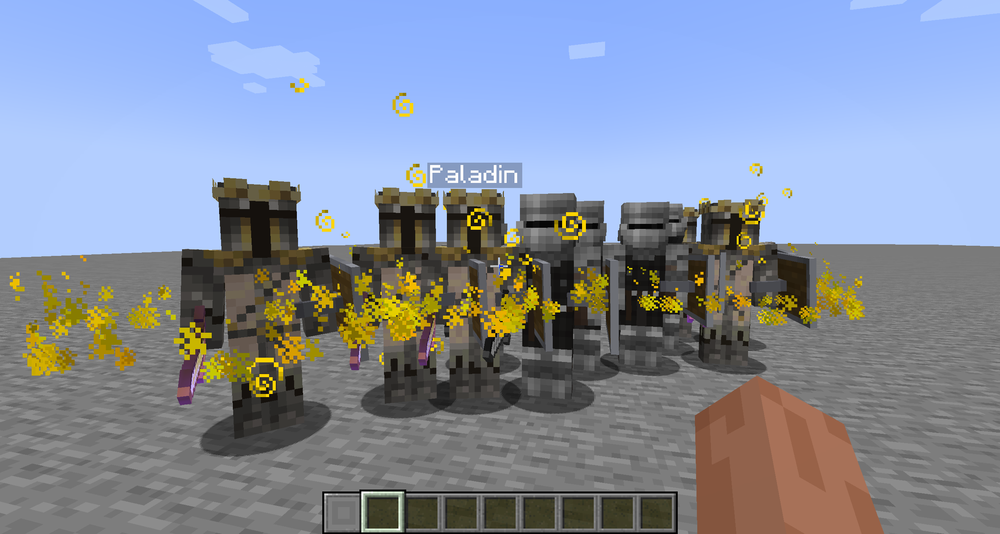
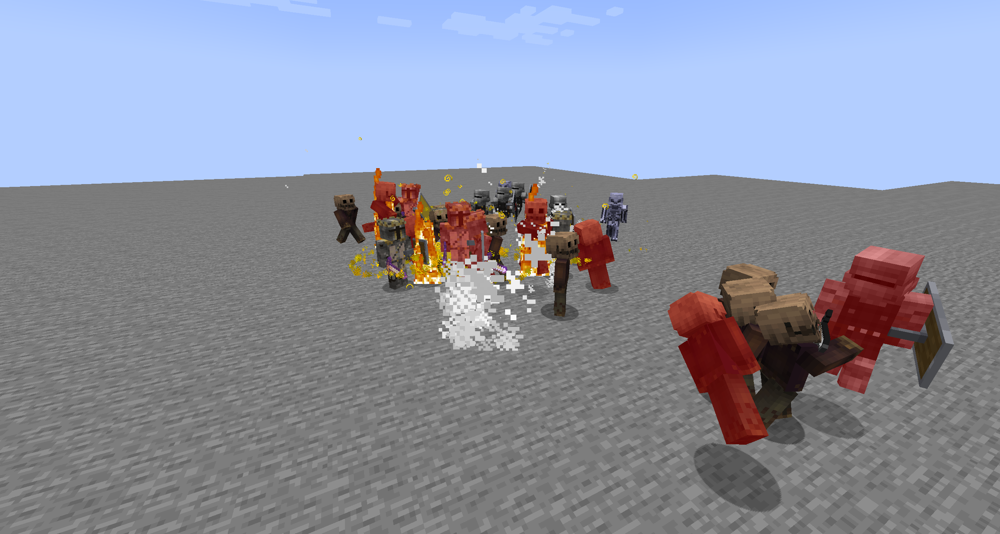
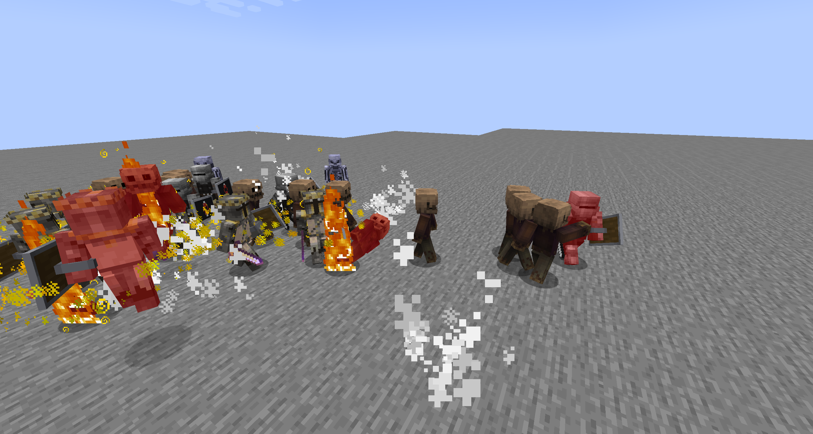

# VoidWorld

## Screenshots








---

Set-ExecutionPolicy -ExecutionPolicy RemoteSigned -Scope CurrentUser
$env:JAVA_HOME = "C:\Program Files\Eclipse Adoptium\jdk-17.0.18.8-hotspot"; .\gradlew.bat runClient 2>&


## Tech Stack

| Component | Version |
|---|---|
| Minecraft | 1.20.1 |
| Forge | 47.4.16 |
| KotlinForForge | 4.11.0 |
| Java | 17 |
| Kotlin | 2.0.0 |
| Gradle | 8.7 |
| Mappings | Parchment 2023.09.03-1.20.1 |

## Getting Started

### Prerequisites

- **Java 17 JDK** (recommended: [Eclipse Temurin](https://adoptium.net/temurin/releases?version=17))
- **Git**
- An IDE with Gradle support (IntelliJ IDEA recommended)

### Setup

```bash
# Clone the repository
git clone <repo-url> minecraft-voidworld
cd minecraft-voidworld

# Generate IDE run configurations
./gradlew genIntellijRuns    # IntelliJ IDEA
# or
./gradlew genEclipseRuns     # Eclipse
# or
./gradlew genVSCodeRuns      # VS Code

# Run the client
./gradlew runClient

# Run the server
./gradlew runServer

# Build the mod JAR
./gradlew build
```

The built JAR will be in `build/libs/`.

## Project Structure

```
src/main/
  java/com/voidworld/
    VoidWorldMod.java              # Main mod entry point (@Mod)
  kotlin/com/voidworld/
    core/                          # Core infrastructure
      registry/                    # DeferredRegister wrappers
      network/                     # Client-server packets
      config/                      # ForgeConfigSpec configuration
      data/                        # Player data (Capabilities)
      event/                       # Forge event handlers
      util/                        # Kotlin extensions & helpers
    system/                        # Game systems
      quest/                       # Quest & dialog engine
      npc/                         # NPC definitions & AI
      economy/                     # Currency, banking, trading
      housing/                     # Player plots & building zones
      law/                         # Crime, fines, prison
      stealth/                     # Stealth mechanics
      summon/                      # Summoned companion creatures
      backstory/                   # Character backstory tree
      puzzle/                      # Programming, riddle, logic puzzles
      donation/                    # Support/donation integration
    entity/                        # Custom entity classes
    block/                         # Custom blocks
    item/                          # Custom items
    world/                         # World gen, biomes, dimensions
    client/                        # Client-side rendering, GUI, HUD
    api/                           # Public API for extensions
  resources/
    assets/voidworld/              # Client resources (textures, models, lang)
    data/voidworld/                # Server data (quests, dialogs, NPCs, recipes)
```

## Key Systems

- **Quest Engine** -- Data-driven quests loaded from JSON, branching stages with multiple objective types
- **Dialog Trees** -- Conditional branching dialogs with NPC conversations, quest triggers, and trade integration
- **Economy** -- Wallet and bank system with interest, fines, and player-to-player transfers
- **Law & Prison** -- Protected city zones, crime tracking, fines, imprisonment with escape mechanics
- **Stealth** -- Light-based detection, rooftop traversal, guard alert AI
- **Summon Companions** -- Customizable creatures from void consciousness fragments with equipable abilities
- **Backstory Selection** -- Decision tree at game start that shapes NPC reactions and available quest paths
- **Housing** -- City plots, wilderness claims, floating island and waterfront properties
- **Puzzles** -- Programming, combinatorics, riddles, and environmental challenges


## License

All Rights Reserved. See LICENSE file for details.
