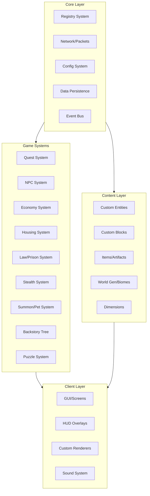

# VoidWorld -- Шаблон Forge-мода для Minecraft 1.20.1

## Оценка проекта

**Масштаб**: Это проект уровня full-scale RPG внутри Minecraft. По объему сопоставим с модами уровня TerraFirmaCraft или Advent of Ascension. Для одного разработчика реалистичный срок -- 1.5-3 года активной разработки.

**Критические системы** (без них игра не работает):

- Квестовая система с ветвлением и диалогами
- NPC с AI, торговлей, диалогами
- Кастомные существа (демоны из Вселенной ложного вакуума, призываемые питомцы)
- Экономика (валюта, банк, штрафы)
- Множество локаций (города, острова, подводный мир, космическая платформа)

**Рекомендация по приоритету**: Вертикальный срез (от кораблекрушения до входа в столицу) как MVP, затем горизонтальное расширение.

## Технологический стек

- **Minecraft**: 1.20.1
- **Forge**: 47.4.16 (latest)
- **KotlinForForge**: 4.11.0
- **Java**: 17, **Kotlin**: 2.0.0
- **Mappings**: Parchment 2023.09.03-1.20.1
- **Gradle**: 8.x с ForgeGradle 6.x

## Архитектура модулей




## Структура пакетов

```
src/main/
  java/com/voidworld/
    VoidWorldMod.java          -- Главный мод-класс (Java для Forge @Mod)
  kotlin/com/voidworld/
    core/
      registry/                -- DeferredRegister обертки
      network/                 -- Пакеты клиент-сервер
      config/                  -- ModConfig
      data/                    -- SavedData, Capabilities
      event/                   -- Обработчики событий
      util/                    -- Утилиты, расширения Kotlin
    system/
      quest/                   -- Quest, QuestStage, QuestManager, Dialog
      npc/                     -- NpcDefinition, NpcAI, NpcTrader
      economy/                 -- Currency, BankAccount, Transaction
      housing/                 -- Plot, PlotManager, BuildZone
      law/                     -- Crime, Fine, Prison, PrisonEscape
      stealth/                 -- StealthState, Detection, StealthMission
      summon/                  -- SummonEntity, SummonCustomizer, Ability
      backstory/               -- BackstoryTree, BackstoryChoice
      puzzle/                  -- PuzzleBase, CodePuzzle, RiddlePuzzle
      donation/                -- DonationIntegration
    entity/
      npc/                     -- NPC entity classes
      creature/                -- Обычные существа
      voidborn/                -- Существа из Вселенной ложного вакуума
      summon/                  -- Призываемые существа
      boss/                    -- Боссы (церебралы, демоны)
    block/
      decoration/              -- Декоративные блоки городов
      functional/              -- Банковский терминал, квестовая доска
      protectedzone/           -- Неразрушаемые/защищенные блоки
      voidcrack/               -- Точки ложного вакуума
    item/
      weapon/                  -- Оружие
      artifact/                -- Артефакты с кораблей
      quest/                   -- Квестовые предметы
      consumable/              -- Расходники
      tool/                    -- Инструменты (Слово мертвеца и т.д.)
    world/
      biome/                   -- Кастомные биомы
      structure/               -- Города, деревни, пещеры, замок
      dimension/               -- Космическая платформа, планета сознания
      feature/                 -- Дыры ложного вакуума, летающие острова
    client/
      gui/                     -- Screens: диалоги, квестлог, банк, кастомизация
      hud/                     -- Оверлеи: стелс, квест-трекер, экономика
      render/                  -- Рендереры существ, эффектов вакуума
      model/                   -- Кастомные модели
      sound/                   -- Звуковые события
    api/                       -- Публичный API мода для расширений
  resources/
    META-INF/mods.toml
    pack.mcmeta
    assets/voidworld/
      blockstates/
      lang/en_us.json, ru_ru.json
      models/block/, models/item/
      textures/block/, textures/item/, textures/entity/, textures/gui/
      sounds/
      sounds.json
    data/voidworld/
      recipes/
      loot_tables/
      tags/
      structures/
      worldgen/
      quests/                  -- JSON квесты (data-driven)
      dialogs/                 -- JSON диалоги (data-driven)
      npcs/                    -- JSON NPC определения
```

## Что войдет в шаблон (реализуемые файлы)

### 1. Gradle и конфигурация сборки

- `build.gradle` -- Forge 47.4.16 + KotlinForForge 4.11.0 + Parchment
- `gradle.properties` -- все переменные мода
- `settings.gradle` -- настройки Gradle
- `gradlew`, `gradlew.bat`, `gradle/wrapper/` -- Gradle Wrapper (через init)

### 2. Ядро мода

- `VoidWorldMod.java` -- точка входа (@Mod), инициализация DeferredRegister
- `ModRegistries.kt` -- централизованная регистрация блоков, предметов, сущностей, звуков
- `ModNetwork.kt` -- сетевой канал (SimpleChannel)
- `ModConfig.kt` -- конфигурация мода (ForgeConfigSpec)
- `ModEvents.kt` -- обработчики ключевых событий

### 3. Базовые интерфейсы и абстракции систем

- `IQuest.kt`, `QuestManager.kt` -- интерфейс квеста, менеджер
- `IDialog.kt`, `DialogTree.kt` -- диалоговая система
- `INpc.kt`, `NpcEntity.kt` -- базовый NPC
- `IEconomy.kt`, `BankManager.kt` -- экономика
- `ISummon.kt`, `SummonEntity.kt` -- призываемые существа
- `ILawSystem.kt` -- система закона
- `IStealthSystem.kt` -- стелс
- `IBackstoryNode.kt` -- дерево предыстории
- `IPuzzle.kt` -- головоломки

### 4. Ресурсы

- `mods.toml` -- метаданные мода
- `pack.mcmeta` -- версия ресурспака
- `en_us.json`, `ru_ru.json` -- локализация (заглушки)

### 5. Документация

- `README.md` -- описание проекта, инструкция по запуску
- `docs/GDD.md` -- Game Design Document с полным описанием сюжета, механик, городов, кампаний, концовок
- `docs/ROADMAP.md` -- поэтапный план разработки

## Roadmap (фазы разработки в GDD)

- **Фаза 1** (MVP): Ядро мода, квестовая система, диалоги, NPC, экономика. Первая локация: остров кораблекрушения -> джунгли -> пещера -> долина -> деревня.
- **Фаза 2**: Столица (город-крепость), замок с летающими частями, основная сюжетная линия до встречи с наемниками.
- **Фаза 3**: Система призыва существ, стелс-механика, система закона/тюрьмы, жилье.
- **Фаза 4**: Дополнительные города (готический, пустынный, снежный, болотистый, венецианский, летающие острова).
- **Фаза 5**: Космическая платформа, планета сознания, финальные концовки.
- **Фаза 6**: Побочные кампании (пираты, подводная, церебралы-пацифист), головоломки, система донатов.

